## 背景

> 牛肠：通过一系列的学习，逐渐有种学习了各种人类的“组成和操作原理”的感觉。通过一系列的工具和实践，我们也可以像调优软件程序那样来“调优”我们自身的人体系统。
> 
> 我从github上获取到多篇论文摘要，但是不够简省，于是我让AI对他们翻译并且写成指南形式.
>
> 然后我重新编写这份指南，重新组织语言并且使用高光标记了要点并且去掉了不适宜的片段。

> 牛肠：原版的 podcast 中有非常多专业性的阐述，在这篇文章中基本都去掉了，相对会比较好理解。严谨性有所下降但是在可接受范围内。

# 睡眠

> 牛肠：如果你想要获得健康，更好的工作学习状态，提升生理健康如免疫，新陈代谢，以及心理健康如更好的心情，专注能力等，最最重要的前提是拥有一个良好的睡眠。

## 原理

睡眠最重要的控制机理是我们内在的**生物钟**。随着生物钟的影响，我们体内的各类化学物质会发生变化，体温也随之改变，会影响我们的各种内在状态和外在行为。

### 生物钟核心调控机制（程序图）
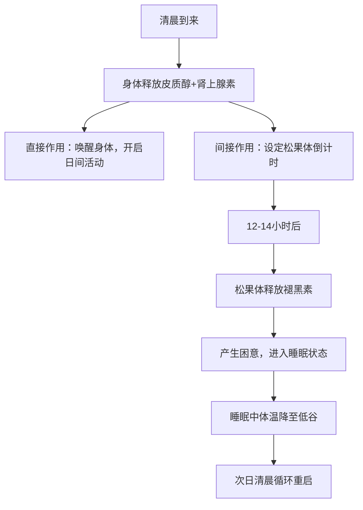

在早上，身体释放的**皮质醇（cortisol）** 和**肾上腺素（adrenaline）** 会让我们醒来，同时还会设定松果体释放褪黑素的倒计时钟，会在十多个小时之后让我们感到困意再次入睡。

### 光照对生物钟的影响机制（程序图）
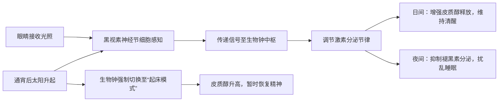

影响这个生物钟的最大因素是**光照**。我们的眼睛除了能够看到东西，另外一个重大的作用就是通过黑视素神经节细胞来接收光照信息，用以设定我们的内在生物钟。

这也是为什么有时候我们通宵工作之后，虽然已经持续很久时间没有睡眠了，但随着太阳升起，整体的生物钟被设定到了类似起床时的状态，各类化学物质的释放会让我们突然感觉又有精神了。后续很多最佳实践里也都跟这个原理相关，我们需要控制自己接收光照的时间点，类型和时长。

### 体温与睡眠周期关联机制（程序图）

此外，**体温**也是一个用于控制我们生物钟的手段。一般来说我们的体温会从深睡眠中比较低的状态逐渐升高，到醒来后持续上升。到了一天的后半段会开始逐渐下降，直到再次进入睡眠。

## 实践

- 皮质醇的释放与接触阳光有关，因此如果想尽快醒来且保持日间良好的精神状态，起床后应该到外面去接触阳光，持续 2-10 分钟。这对于血压控制，心理状态，设定睡眠的“倒计时钟”等都有很大好处。
  户外日光的效果最好，如果是人造光源，蓝光的效果会比较好，且最好是上部（天空的位置）的光源。根据光照强度推算，隔着窗户接收日光的强度会降低 50%以上，而达到同样效果所需要的光照时间则需要 50 到 100 倍。
  有意思的是，这一点对于视障人士也有效，因为前面提到的黑视素神经节细胞并不是用于视觉成像的细胞。

| 光照类型 | 效果特点 | 所需时间 |
|----------|----------|----------|
| 户外日光 | 效果最佳 | 2-10分钟（基准） |
| 隔着窗户日光 | 强度降低50%+ | 50-100倍基准时间 |
| 上部人造蓝光 | 优于普通人造光 | 适当延长基准时间 |

- 对应的，在晚上要尽量减少光源的接触，因为这会扰乱我们的生物钟，让身体系统误以为是在白天。尤其是晚上 11 点到次日凌晨 4 点之间接收光源，会抑制后续几天的多巴胺的释放，影响心情，心理健康，专注度，学习能力，新陈代谢等等。关于多巴胺的作用和机理，后面会再单独介绍。

- 人一天中的精神状态一般会在中间有个短暂的低谷，所以午睡对于有些人可能是有帮助的。也可以用一些其它的非睡眠深度休息的方式来替代，如：
  - [Yoga Nidra](https://youtu.be/M0u9GST_j3s)
  - [冥想](https://www.headspace.com/)
  - [自我催眠](https://www.youtube.com/c/MichaelSealey)

- 体温对生物钟周期的影响：
  - 早上洗冷水澡，会让人快速升温，从而把睡眠周期往前移（早起）。
  - 晚上锻炼身体，会让人保持高体温，从而导致周期延后（晚睡）。

- 饮食和药物因素：
  - 咖啡因会占据腺苷（adenosine）的受体，阻断入睡的信号。有不少文章都提到中午之后尽量不要喝咖啡，但 Huberman 表示没有科学实验表明咖啡因对所有人的效果是一样的，得根据自己的测试情况来。比如他自己在下午 5 点喝咖啡也能正常入睡。
  - 镁，对入睡有帮助。

- 对于绝大多数人，6-8 小时的睡眠时长是比较健康的。

# 饮食

> 牛肠：这一段太长而且实践难度比较大。牛肠便去掉了关于饮食的这一段。

# 心态与动力

> 牛肠：这一部分主要介绍的是人体的多巴胺系统原理，以及如何利用它来形成健康，自律的生活方式，对于强健我们的心智有着非常好的指导作用。

## 原理

多巴胺是一种非常重要的化学物质，主要作用于两个神经回路：
- 一个影响身体的运动，例如帕金森病与多巴胺的分泌不足有关；
- 另一个则影响我们的动机，欲望与快乐，这几乎与我们从事的各种活动有关，无论是工作，学习还是社交，休闲娱乐。

这里我们会主要讨论多巴胺的后者影响能力。我们为什么会“放弃”？实际上是由于在不安，压力，沮丧等情绪作用下，身体内的去甲肾上腺素水平不断提升，当超过一定阈值时，神经系统中的认知控制就会关闭，我们就放弃了。**多巴胺能够抑制去甲肾上腺素作用，从而持续“激励”我们前行**。

### 多巴胺与“放弃”的对抗机制（程序图）
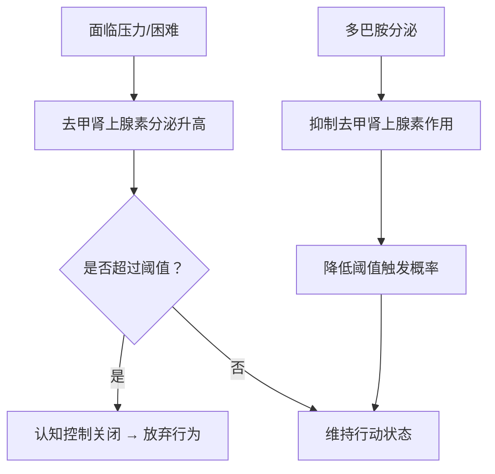

神经系统中多巴胺含量水平的高低会影响我们的情绪：
- 当多巴胺水平低时，我们会感到情绪低落，没有动力；
- 当多巴胺水平高时，我们会感到兴奋和快乐。

在通常情况下，我们的身体处于多巴胺 baseline 的状态，当我们达成一些令人兴奋的目标（比如玩游戏胜利，考试拿高分）后，多巴胺的水平会达到一个高峰，此时我们就会获得巨大的愉悦感。在高峰之后，多巴胺水平会回落到比 baseline 更低的一个水平，且这个状态会持续一段时间。

### 多巴胺水平变化周期（程序图）
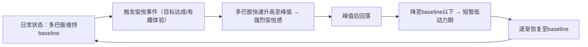

这里有两个非常重要的原理：

1. **多巴胺绝对值含量的高低只是一方面，更重要的是其“相对变化量”的多少**。
   比如在刷抖音时看到了一个很有趣的视频，多巴胺水平升高，你会感到快乐；刷到下一个视频时，你感到的快乐程度好像不会那么强烈了，因为多巴胺已经在一个比较高的水平，难以形成更大的变化量。而同样的视频，如果你是几天之后看到，或许你会觉得有意思的多。
   所以**当你持续做一件喜欢的事情时，你感受到快乐的阈值也会不断提高**。

### 多巴胺相对变化量影响机制（程序图）

2. **多巴胺的总体“储备”是有限的**！
   也就是说无论你是通过学习，工作，娱乐，社交，运动等不同方式来获得快乐，所消耗的“快乐货币”都是同一种：多巴胺。举几个例子来看下这个原理带来的影响：
   - 很多自律的人都会说自己是 work hard，play hard 的生活方式，比如工作日通过高强度的工作来获得成就和满足感，休息日进行各种休闲娱乐，运动，社交等方式来获得快乐，其实背后都是在释放多巴胺来获取快乐。长期持续，我们身体的多巴胺 baseline 会逐渐下降，出现一种耗尽（burn out）的心理感觉，对很多事物无法保持之前的兴趣与精力。
   - 很多人会对玩电子游戏着迷，因为它们能带来巨大的多巴胺释放刺激让人感到快乐。但要意识到，多巴胺的储备是有限的，如果对此上瘾，你的多巴胺耗尽问题就会变得非常严重：一方面能够引起你兴趣的事物会变少，可能只有玩游戏才能带来快乐；另一方面，后续甚至会导致玩游戏本身也无法触发多巴胺释放，引起严重的抑郁问题。

### 多巴胺储备消耗机制（程序图）
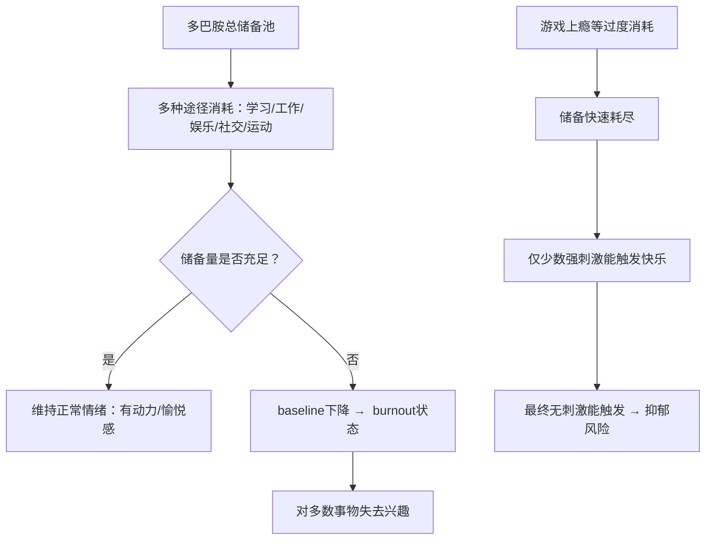

另外，**多巴胺也具有叠加效应**。比如你喜欢健身，那么运动就会刺激多巴胺的释放。而我们实际去健身时，可能会不自觉地安排了很多其它的“快乐因素”，比如选一个精神状态比较好的日子，运动前喝一些能量饮料，跟认识的朋友一起去，边健身边 social，听一些自己喜欢的音乐或 podcast，等等。这些因素也都会促进多巴胺的释放，让你感到“前所未有的快乐”。但要注意前面的原理，多巴胺的高峰越高，后面随之而来持续的低谷也会越长，而且长此以往，可能会降低你单纯从运动中获取快乐的能力。
这样的例子还有很多，比如边跟朋友吃饭，边玩手机，拍照发朋友圈，可以计算一下叠加了几种快乐因素 :)

### 多巴胺叠加效应机制（程序图）
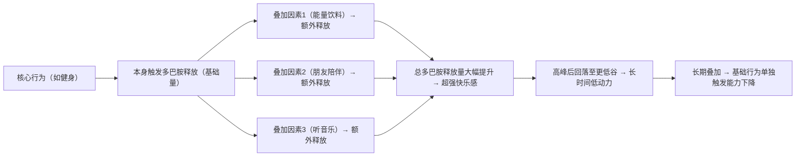

## 影响多巴胺的外界因素

我们来看下具体影响多巴胺释放的各类因素有哪些，首先是促进多巴胺分泌的：

> 牛肠：这一段有些不适宜展示以及对高中生无效的条目我去掉了。

- 巧克力，提升到 1.5 倍的多巴胺 baseline。
- 咖啡因本身只会少量提升多巴胺，但它会抑制一些多巴胺受体，提升同等多巴胺造成感受的效果。
- 运动，带有主观成分，喜欢跑步的人，可以提升到 2 倍 baseline。
- 健康的社交关系也会促进多巴胺释放。

通常来说，**不推荐持续使用药物**，因为多巴胺释放之后的高峰会带来 baseline 水平的降低，导致无法享受活动的快乐，无法专注，限制学习能力和神经元可塑性等。

最后还有一个比较特别的研究，就是**冷水浴能够提升多巴胺释放到 baseline 的 2.5 倍左右，且持续时间更长，能达到 3 小时左右**。建议使用 10-14 摄氏度的水温，注意安全。此外冷水浴也不需要太频繁，每周 11 分钟左右足够。如果已经习惯了冷水浴，那么也就没有释放多巴胺的效果了。

还有一些因素会降低多巴胺，如：

- 睡眠时段接触光源，也会引起接下来几天的多巴胺水平下降。半夜睡不着刷手机是很有害的哦。

### 外界因素对多巴胺的影响（程序图）
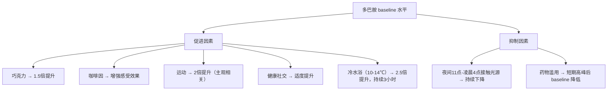

## 成长型思维

最后来看下如何构建良好的思维方式来利用多巴胺系统提升自我。

有一个非常知名的实验：挑选了一群天生喜爱画画的小朋友，在他们完成画作后给与一些奖励。后面在移除这些奖励后，小朋友们对于画画的兴趣和动力大大降低了。
这个实验说明，**当我们因为一个活动收到奖励（比如金钱，美食等）时，我们反而会降低活动本身的愉悦程度**。而且多巴胺本身影响我们对时间的认知，同时也影响我们的情绪状态，如果我们**始终以完成活动后的奖励为目标，则整个过程中就很少释放多巴胺，让原本困难的过程变得更加难以坚持**。

### 外部奖励对内在动力的影响（程序图）
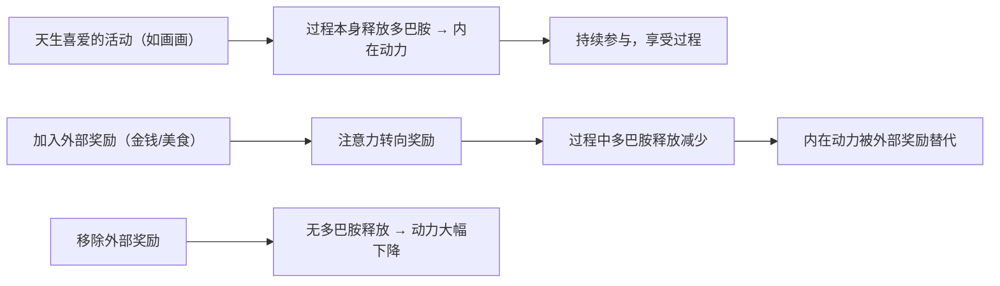

仔细想一下，这是一个非常有意思的观察。多巴胺有点像我们的“本能系统”，决定了我们是否有动力做一件事。但反过来我们的主观思想却可以影响这个系统起作用的方式，这也是人类为何能摆脱动物本能，达成很多需要“反人性”的投入才能取得的成就的原因吧。
上述的实验是我们的主观思想造成的一个反面作用的例子，我们自然也可以实现正面作用，那就是**成长型思维**。

具体来说，就是**通过自我暗示，把努力过程本身当作一种“奖励”**。我在努力学习，这个过程本身就是有趣的，会让我不断变得更强，这样的想法会在过程中激发身体系统释放多巴胺，而多巴胺提升了我们的情绪和动力水平，也会让努力的过程中碰到的困难变得相对容易克服。
专注于这个过程的本身，而不是在过程前进行各种外界刺激（如前面提到的药物），或者在过程后给自己巨大的奖励。

### 成长型思维的多巴胺激活机制（程序图）
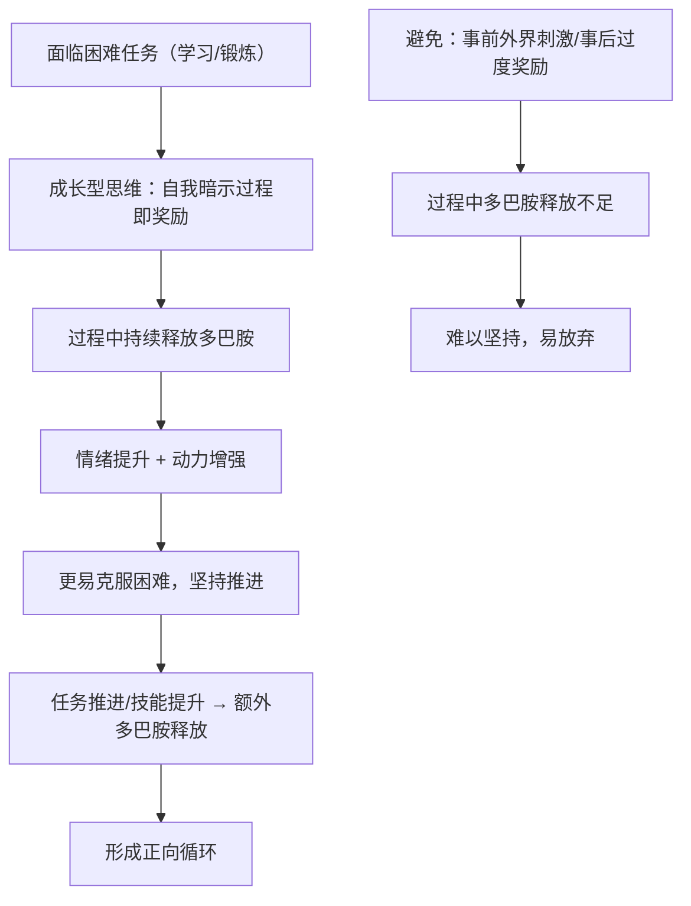

这种思维方式看起来很主观，但这就是我们的神经系统工作的方式，**虽然人类的“硬件系统”都差不多，但知识，思维这些运行之上的“软件”却可以千差万别**。我们可以通过自律，自我暗示来改变自身对各类活动的喜好。例如通过暗示锻炼对我们健康的益处，来获取满足感，而不是借助于锻炼结束后的大快朵颐。通过自律抵御高油盐食物的吸引力，并且自我暗示植物类食物对身体的好处。

# 学习与专注

在了解了多巴胺的运作机制基础上，我们可以继续探究一些跟大脑健康，专注度，如何进行高效学习相关的话题。

## 学习的原理

从脑神经科学来看，学习的本质是**神经元的重新连接（rewire）**，进一步来看，需要大脑处在一种学习的化学状态下，也就是 Huberman 经常提到的**神经可塑性（neuroplasticity）** 状态。
要达到这个神经可塑性状态，有两个重要条件：
1. 足够的专注度；
2. “犯错”的信号。

另外大脑一个比较有意思的机制是，在学习时的神经可塑状态下，乙酰胆碱会标记需要改变的神经元，而具体的神经元重连接则主要是在休息和睡眠时发生，是不是有点像 JVM 虚拟机的垃圾回收机制 :)"

### 神经可塑性触发与神经元重连接机制（程序图）
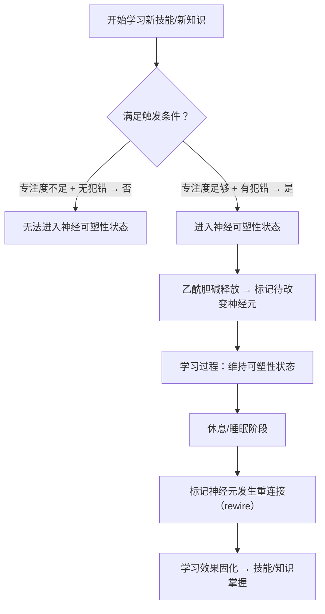

- 什么是犯错信号呢？当我们尝试做一些事情，但没有达到预期目标时，身体会给大脑发信号，“我犯错了”。处在这种犯错，沮丧的认知状态下，神经系统会释放肾上腺素（提升 alertness），乙酰胆碱（提升 focus），多巴胺（促进神经元的 change，rewire）等化学物质，激活神经元的可塑性。也就是说，**犯错是我们进入学习状态的重要前提**。---这跟我们训练AI模型不是一模一样么 :)"

### 犯错信号激活神经可塑性机制（程序图）
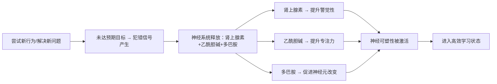

- 另外很多人可能觉得心流（flow）状态是学习的最佳状态，而 Huberman 则不这么认为。心流是一种精神高度集中且接近于自动化的状态，是在做我们已经知道怎么做的事情，而不是在学习新的知识技能。

### 心流状态与学习状态对比（程序图）
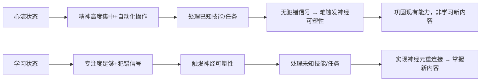

对于这个学习状态，经典的实验是给人们戴上一些能转变角度的眼镜，然后执行一些类似物体抓取的任务。由于看到的东西通过眼镜改变了其本来的位置，一开始在尝试时总会出现抓取动作的偏离。但后续在进入神经可塑性状态后，我们能逐渐适应相关的视觉偏移，协调自己的听觉，动作等都与之协同，顺利完成任务。
更有意思的是，这个“神经可塑性”的化学状态是可以持续的，我们甚至可以先通过一些其它操作触发大脑的这个机制，再去进行真正的学习，以加快学习的速度。

这里还有一个隐藏逻辑，当你在遇到挫折困难时，大脑进入了可塑性状态，而此时你却放弃了，那么**神经元也会重新连接到这种容易放弃的行为模式，形成恶性循环**。

### 挫折应对与行为模式固化机制（程序图）
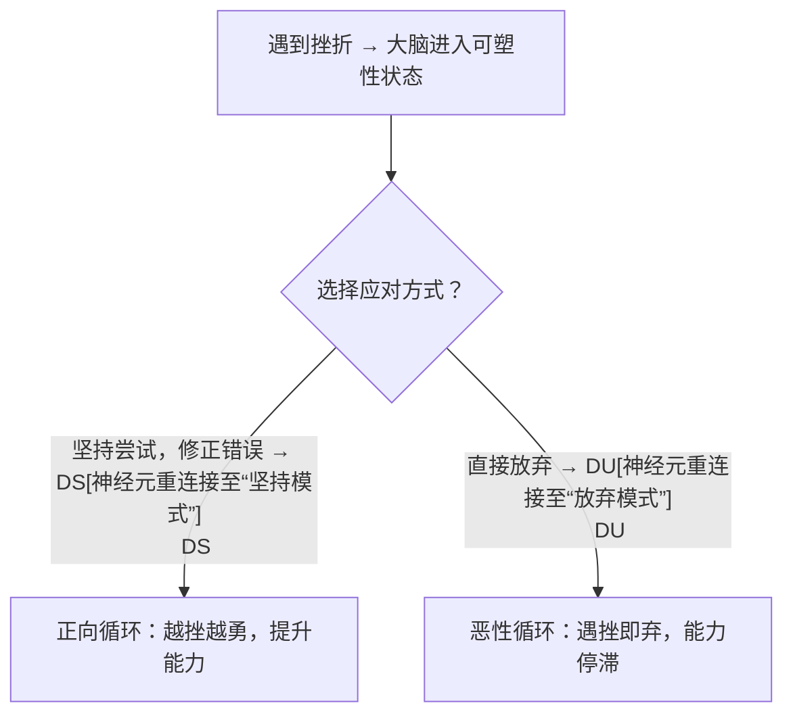

另外，**休息和睡眠时也会发生大量的神经元重连接的活动**，这也是之前我们就提到过的，高质量的睡眠是实现很多生理，心理健康强壮的先决条件。

## 利用神经可塑性

- 通过实验发现，**成年人对于小幅度的增量学习是完全可以适应与掌握的**。例如每次视觉上的偏差只有 7 度，而不是一下子就来个 180 的大颠倒，那么成年人也能很快从错误中学习纠正。

### 增量学习适应机制（程序图）
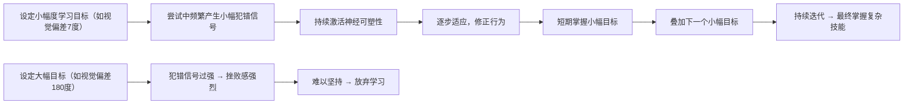

- 对于达成目标的渴求度越高，重要性越大，奖励的刺激越大（比如为了生存），则神经可塑性就会越容易出现。这个比较符合直觉，但是现实中可操作性可能不高。

- 第三点最有意思，**通过扰乱前庭神经系统（vestibular system），能够达到神经元可塑性的状态**。简单来说，就是让你的身体有一些“新颖的重力体验”，如倒立，瑜伽，体操，滑板，任何让身体会失去平衡的一些状态等，会快速激发“我犯错了”的信号，进入学习状态，甚至可以在之后去做别的任务的学习。
  *（牛肠：我想到了淘宝成立初期的“倒立文化”，没想到还真的有科学依据）*
  需要注意的是，这个体验必须要新颖，也就是说如果你已经倒立很熟练了，那么去做倒立就是个日常行为，并不会给身体一种在犯错边缘，需要纠正的刺激。

### 前庭系统扰乱激活可塑性机制（程序图）
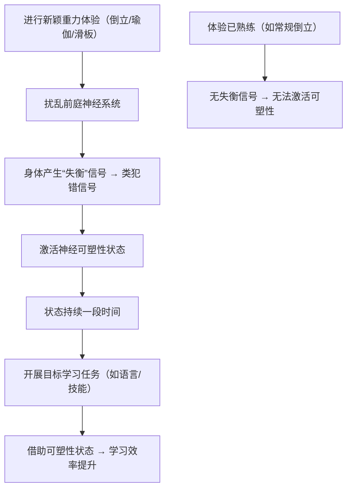

## 学习的理想状态

除了神经可塑性的化学状态外，我们也需要注意其它的因素。例如我们不能太放松以至于有些昏昏欲睡，也不能太紧张激动，无法控制自己拥有清晰的思考等。这些也都跟我们体内的多巴胺，肾上腺素，乙酰胆碱，血清素，褪黑素等化学物质的水平有关，需要做好调节。

在之前 Rich Roll 的访谈节目中，Huberman 提了一个非常有效的“呼吸工具”，叫**生理叹息（Physiological Sigh）**。操作方法上简单来说就是吸两口气，然后出一口长气。通常情况下，只要一两次生理叹息就足以使我们的压力和警觉水平迅速下降，让人感到更加平静，提升学习表现。

### 生理叹息调节学习状态机制（程序图）
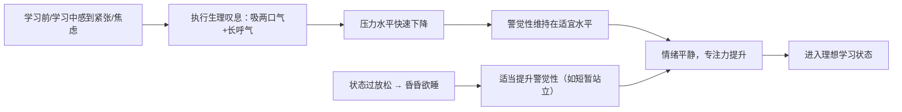

前面提到的成长型思维也很重要，在遇到错误导致的沮丧感觉时，可以不断增强自我暗示，失败是帮助我们学习成长的唯一路径，对我们是有益的，以此增加多巴胺的释放，提升学习动力和过程中的愉悦感。

联系到睡眠对学习的促进作用，也有一些研究提供了一些相关的 tips：

- 在学习或入睡时播放一些微弱节拍，能够提升学习和记忆的效果。
- 一般在 90 分钟的学习后，可以选择进行 20 分钟的休息（non sleep deep rest），也会加强学习的效果。
- Gap effect，在学习中随机停止 10 秒钟，这些停止会在睡眠中加速“播放”，提升学习效果。

### 学习辅助技巧效果机制（程序图）
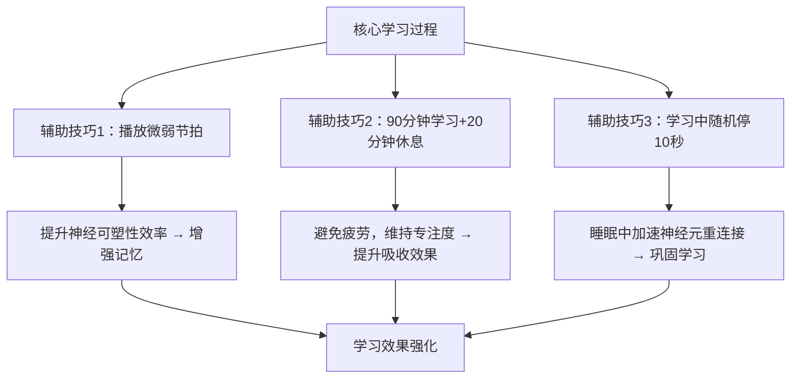

## 提升专注

> 牛肠：原文看不懂，我用AI对这一段做了摘要。

- 适量补充 **Omega-3 EPA 鱼油**，这是神经细胞的组成原料之一，能够有效减轻抑郁，对治疗多动症（ADHD）也有帮助。

- 通过身体其它部分释放运动，可以帮助提升注意力。教授举的例子是作为神经科医生在开刀时，如果采用半蹲半站的姿态（运动释放），拿手术刀的手更稳定不容易颤抖。这让我想起以前读书时很多同学习惯转笔，现在工作了也有不少人喜欢玩指尖陀螺，或者站立办公，可能都是类似效果。

- 限制视野范围，能够提升专注度。比如我们经常因为眼睛瞟到了任务栏上的消息提示闪动而分心，可以通过一些设置来进入“专注模式”。

- 视线的高低也会影响神经状态，视线往下看会让神经系统偏向镇静，放松，甚至困倦，而视线向上则会让系统提升警惕。工作时一般至少把显示器放置在鼻子位置之上。

- 大脑不擅长处理大量频繁的 context switch (计算机术语，上下文切换)，典型的比如刷抖音，不同的信息以非常快的速度频繁切换，这对我们的注意力是有伤害作用的。

- 还有研究表明，17 分钟的冥想，能够对大脑中的神经元做重新连接，永久地改善注意力。*完全可以尝试一下。*

### 专注度提升机制汇总（程序图）
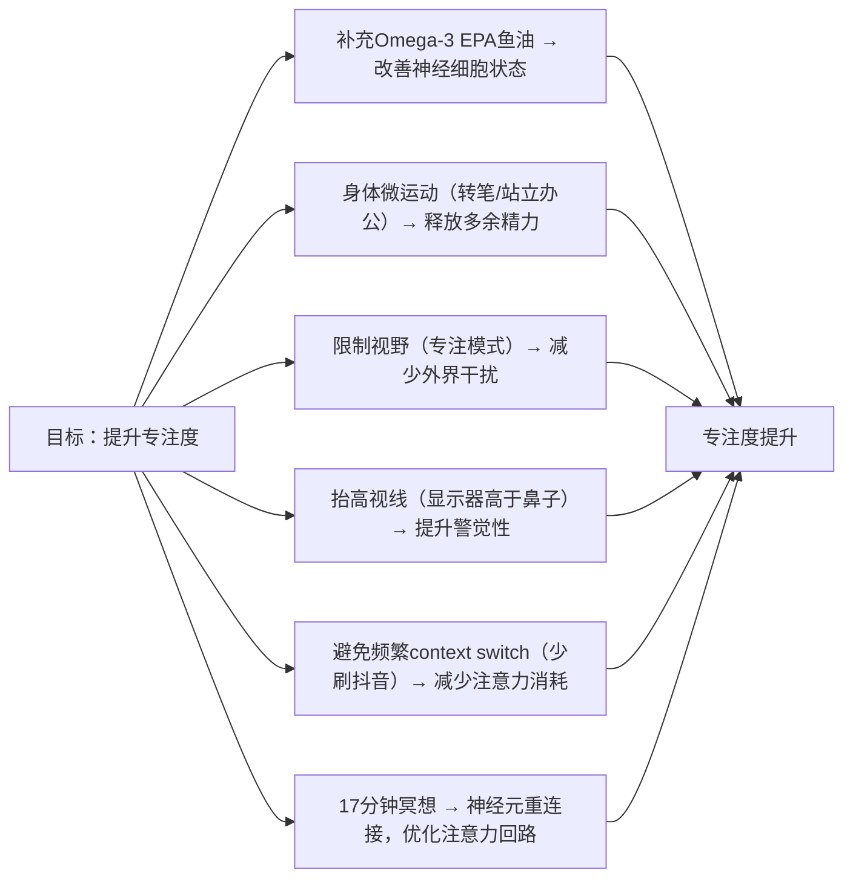
