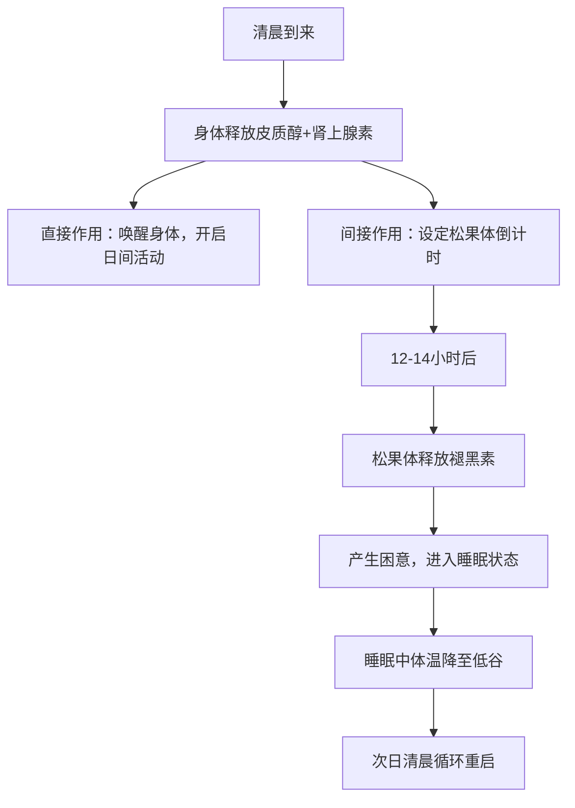
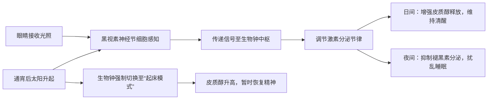
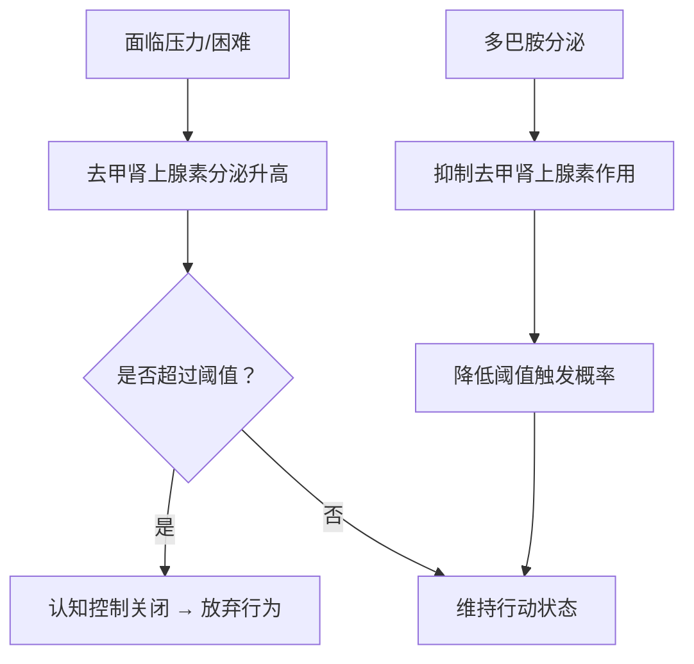
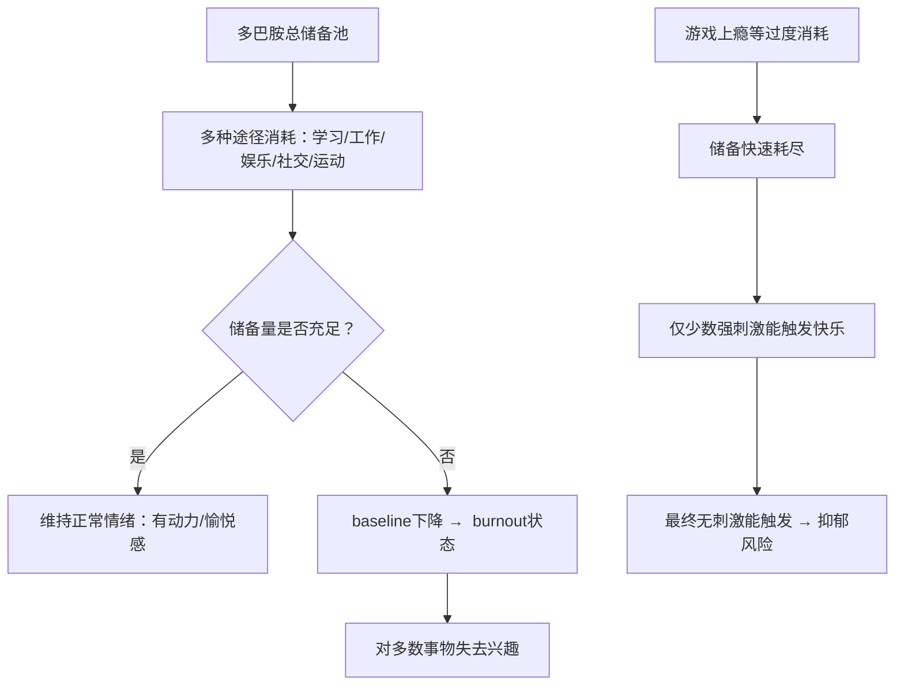
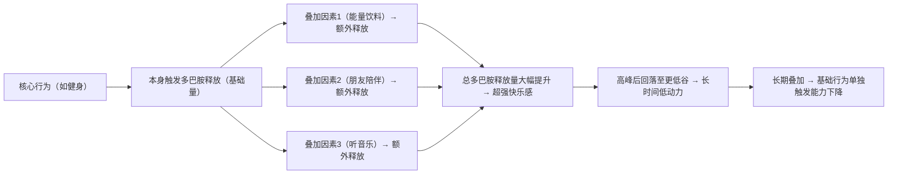
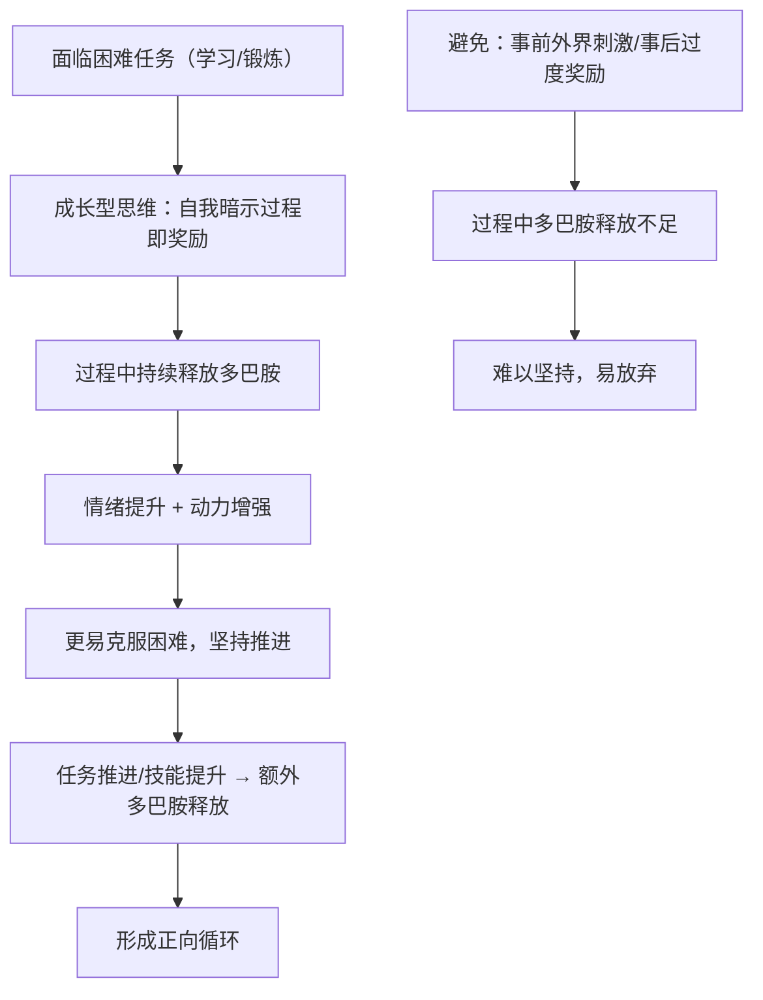

## 背景

> 牛肠：通过一系列的学习，逐渐有种学习了各种人类的“组成和操作原理”的感觉。通过一系列的工具和实践，我们也可以像调优软件程序那样来“调优自己”。

> 我从github上获取到多篇论文摘要，但是不够简省，于是我让AI对他们翻译并且写成指南形式.

> 然后我重新编写这份指南，重新组织语言并且使用高光标记了要点并且去掉了不适宜的片段。

> 牛肠：原版的 podcast 中有非常多专业性的阐述，在这篇文章中基本都去掉了，相对会比较好理解。严谨性有所下降但是在可接受范围内。

# 睡眠

> 牛肠：如果你想要获得健康，更好的工作学习状态，提升生理健康如免疫，新陈代谢，以及心理健康如更好的心情，专注能力等，最最重要的前提是拥有 `高质量睡眠`。

## 原理

睡眠最重要的控制机理是我们内在的 ``生物钟``。随着 `生物钟` 的影响，体内的**化学物质**和**体温**会发生显著变化，最终决定我们的 `精神状态` 与 `健康水平`。

### 生物钟核心调控机制（程序图）

在早上，身体释放的 **皮质醇（cortisol）** 和 **肾上腺素（adrenaline）** 会让我们醒来，同时还会设定松果体释放褪黑素的倒计时钟，会在十多个小时之后触发入睡。`切记作息的重要性！`

### 光照对生物钟的影响机制（程序图）

影响生物钟的最大因素是 ``光照``。眼部神经除了成像，还能感知光线，帮助我们设定清醒或困倦的时间。`早睡早起，规律见阳光，对健康极为重要！`

### 体温与睡眠周期关联机制（程序图）

此外，**体温**也是调控生物钟的关键手段。`规律锻炼、合理饮食、正确洗澡时间，都能帮助你调整体温节律，获得更好睡眠。`

## 实践

- `皮质醇` 的释放与 `接触阳光` 有关，因此**起床后应尽快到户外见阳光**，持续 `2-10分钟`。有助于 `心情调节`、`血压控制` 及 `免疫力增强`。`坚持每天见早晨阳光，等同于给身心充电！`
- 晚上应``减少光源刺激``（特别是`蓝光`），尤其在 `23点-凌晨4点` 之间。`晚上刷手机会毁掉你的睡眠质量！`
- 精神状态的 `日中低谷`，可以选择适度午睡或体验如 `Yoga Nidra`、`冥想`、`自我催眠`。`高效休息比漫无目的打盹更佳！`
- `早晨洗冷水澡` ——会让人快速醒来，有助于提前睡眠周期，建议早起后尝试。
- 晚上锻炼身体，会导致体温持续高位，可能让睡眠周期延后，`如需早睡，尽量避免临睡前剧烈运动！`
- 饮食与药物方面，`咖啡因`会延迟入睡，尽量在中午前饮用。`镁元素`有利于睡眠、可适度补充。
- 对绝大多数人来说，`6-8小时高质量睡眠是最低标准`，不要以为熬夜是“努力”！

# 心态与动力

> 牛肠：这一部分主要介绍的是人体的`多巴胺系统原理`，以及如何利用它形成健康、自律的生活方式，对于强健我们的`心智`有着非常好的指导作用。

## 原理

多巴胺是一种极其重要的神经递质，主要作用于两个回路：
- `身体运动控制`（如帕金森病）；
- ``动机、欲望与快乐回路`` ——直接影响我们的工作、学习、社交动力。

关键结论：`多巴胺水平`决定你的活力和努力。`低多巴胺=易沮丧、无动力，高多巴胺=兴奋、快乐、有冲劲。`

### 多巴胺与“放弃”的对抗机制（程序图）

> `面对压力时，坚持和放弃其实就是化学物质的博弈！`

多巴胺的 `绝对水平` 和 ``相对变化量`` 都很重要。`持续做喜欢的事，快乐阈值会上升，新鲜感变弱，需要不断切换挑战体验。`

> ``不要过度沉迷任何刺激，尤其是刷短视频或游戏，快乐阈值会被不断拉高，最后只剩厌倦和疲惫。``

### 多巴胺储备消耗机制（程序图）

`多巴胺储备是有限的，一天到晚只做极其刺激的事（如刷剧、狂玩游戏）会让你对其它事情完全失去兴趣，变得懒散无动力！`

> ``要学会“分配快乐”，平衡工作娱乐，守住自己的多巴胺底线。``

### 多巴胺叠加效应机制（程序图）

> `你可以让健康行为变得更快乐（如健身时听歌、约朋友），但不要把“辅助刺激”变成习惯，否则单一活动的快乐会迅速衰减。`

## 影响多巴胺的外界因素

促进多巴胺释放的因素：
- `巧克力`提升至1.5倍 baseline；
- `咖啡因`少量直接提升，同时增强感受效果；
- `运动`（尤其主观喜爱者，可提升到2倍 baseline）；
- `健康社交`促进一小段提升；
- ``冷水浴（10-14℃）可提升至2.5倍，且可持续3小时！``

抑制多巴胺的因素：
- `夜间11点~凌晨4点`刷手机、“见光”会持续降低多巴胺；
- `药物滥用`导致基线水平下降，快乐无感！

> `建议：每天锻炼、健康饮食、规律作息、减少夜间蓝光+手机刺激，高效分配多巴胺储备。`

# 成长型思维

成长型思维的核心在于：`通过自我暗示，把努力过程本身当作奖励，把追求目标、挑战自我视为乐趣。`

> ``奖励会挤占你对活动本身的乐趣，降低动机与效率。正确方法——专注享受挑战与过程本身。``

### 成长型思维的多巴胺激活机制（程序图）

>  
> `把“挑战本身”视为奖励，是成长型思维的关键，也是激发多巴胺动力的根源。`

# 学习与专注

> `学习的本质`是大脑神经元的重连接（rewire），建立新通路。

要点：
1. `足够的专注`是激活神经可塑性的前提；
2. `犯错信号`能提高学习效率，推动神经元真正发生改变！

> ``只有适度挑战、犯错，才可能快速成长。不要害怕失败！``

睡眠与休息阶段，同样是巩固新知识的核心窗口。`熬夜、缺觉是高效学习的头号杀手！`

## 利用神经可塑性

- 增量学习、设定小目标、频繁“犯错——修正”，是适应复杂变化的最佳途径。
- `渴望达成目标`、`奖励感提升`能加强神经元塑性，但切不可只为奖励而努力。
- ``新奇重力体验如倒立、滑板等，可以短暂激活大脑的学习状态，建议适度尝试。``

## 学习的理想状态

- `警觉与放松度要恰好`，太紧张或太松弛都不利于学习。
- ``生理叹息法``（两次快速吸气+一次缓慢呼气）可以迅速降低焦虑，维持专注。
- `高质量休息与睡眠周期、辅助技巧、成长型思维`都是提升学习力的必备方法！

## 提升专注

- `Omega-3 EPA 鱼油`有助于神经健康，可适度补充。
- `微运动、正姿、站立办公`释放多余精力，避免注意力耗散。
- `限制视野范围，专注模式`避免被外界刺激影响点滴专注力。
- `显示器位置优于鼻子，视线抬高可提升警觉性。`
- ``减少频繁刷短视频、避免上下文切换``，保护你的注意力系统。
- `每天一次冥想（17分钟），或其它形式深度休息，有助于重新构建专注回路。`

> ``专注是一切高质量生活与学习的基础！练习专注力，终身受益。``
